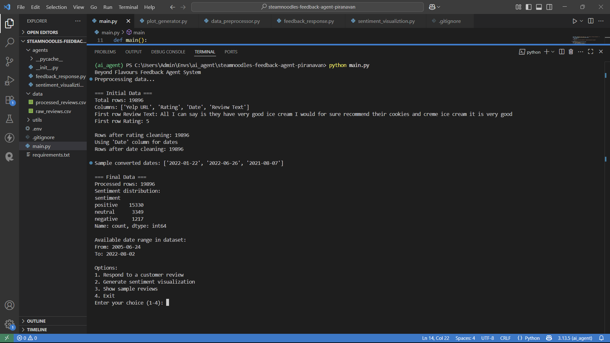
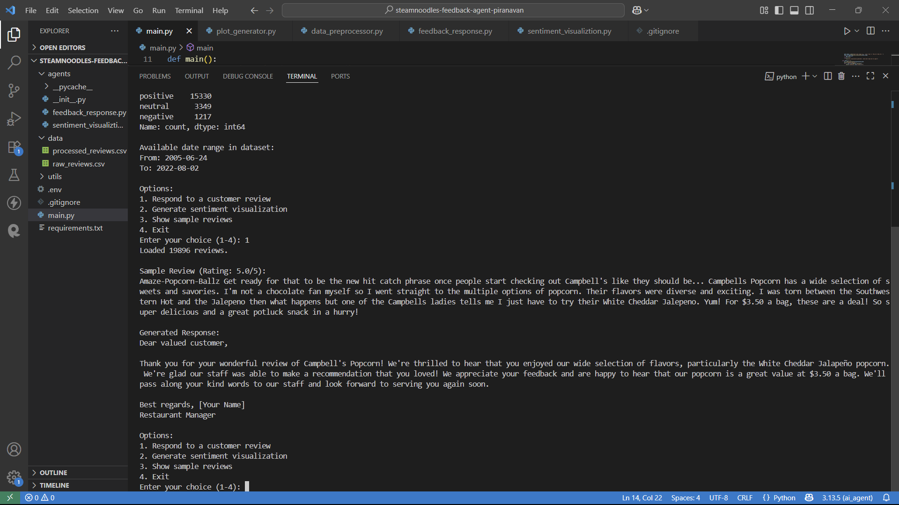
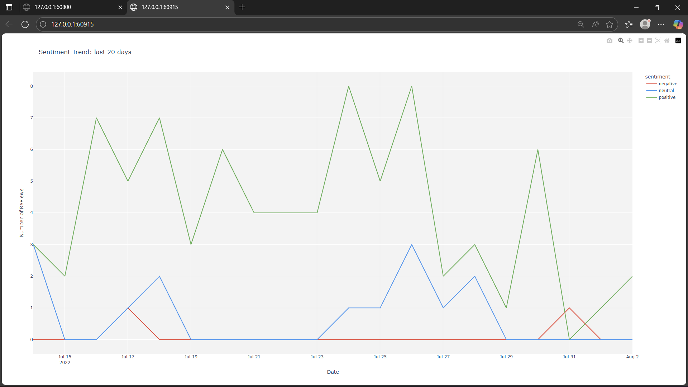
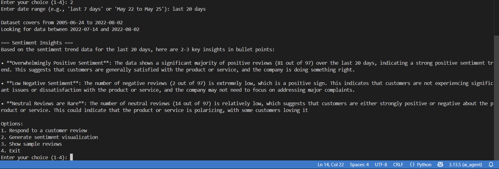
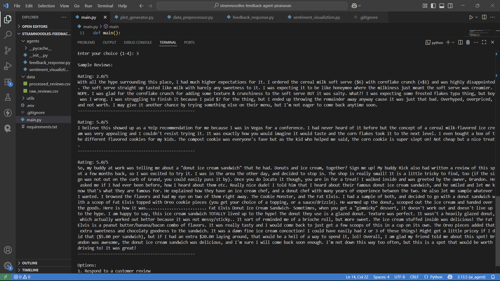

---

# SteamNoodles Automated Restaurant Feedback Agent — Backend

**University:** University of Moratuwa  
**Year:** 2nd Year  

## Project Summary
Implements a multi-agent AI framework for SteamNoodles to automate and personalize customer feedback analysis using modern AI techniques.

- **Agent 1: Feedback Response Agent**: Accepts customer feedback, determines sentiment (positive/negative/neutral) using LLMs, and generates a polite, context-aware reply.
- **Agent 2: Sentiment Visualization Agent**: Accepts a date range, generates a bar/line plot showing sentiment trends over time.

## Features Completed
- FastAPI backend with endpoints for both agents
- Sentiment analysis and auto-response for reviews
- Dynamic sentiment visualization for selected date ranges
- Sample review data endpoint
- CORS enabled for frontend-backend communication

## Setup Instructions
1. Install dependencies:
   ```sh
   pip install -r requirements.txt
   ```
2. Start the backend server:
   ```sh
   uvicorn app:app --reload
   ```
3. Ensure the frontend is running and points to `http://127.0.0.1:8000` for API calls.

## How to Test Each Agent
- **Feedback Response Agent**: POST to `/respond_review` with review text and rating. Returns an AI-generated response.
- **Sentiment Visualization Agent**: POST to `/visualize_sentiment` with a date range. Returns a sentiment plot (or demo message).
- **Sample Reviews**: GET `/sample_reviews?count=3` to fetch random reviews.

## Sample Prompts & Expected Outputs
- **Feedback Response**: POST `{ "review_text": "Great food, slow service.", "rating": 3 }` → Expect a polite, context-aware reply.
- **Sentiment Visualization**: POST `{ "date_range": "last 7 days" }` → Expect a bar chart or demo message.

## Technologies Used
- FastAPI (Backend)
- LLM Services: OpenAI GPT, HuggingFace Transformers
- Python Libraries: pandas, matplotlib, seaborn, plotly

## Dataset
- Kaggle restaurant review dataset (with text, sentiment, and timestamp)

## Deliverables
- Working source code for both agents
- README with setup and testing instructions
- Sample outputs (auto-response and sentiment plot)

## Evaluation Criteria
- Functionality of both agents (40%)
- Use of LLMs + Sentiment logic (25%)
- Code quality & documentation (20%)
- Innovation & improvements (15%)

## License
MIT
    df['rating'],
    bins=[0, 2, 4, 5.1],
    labels=['negative', 'neutral', 'positive'],
    right=False
)
````

* **0 ≤ rating < 2** → `negative`

* **2 ≤ rating < 4** → `neutral`

* **4 ≤ rating ≤ 5** → `positive`

* This sentiment label is then used by:

  * **Agent 1**: To generate polite, context-aware replies.
  * **Agent 2**: To create daily sentiment visualizations.

---

## ⚙️ Setup Instructions

1. **Clone this repository**
   ```bash
   git clone https://github.com/Piranavan25/Steamnoodles-feedback-agent-Piranavan.git
   cd Steamnoodles-feedback-agent-Piranavan
   ```

2. **Create and activate virtual environment**
   ```bash
   python -m venv venv
   source venv/bin/activate   # Linux/macOS
   venv\Scripts\activate      # Windows
   ```

3. **Install dependencies**
   ```bash
   pip install -r requirements.txt
   ```

4. **Add your Groq API Key**
   Create a `.env` file in the root folder:
   ```bash
   GROQ_API_KEY=your_groq_api_key_here
   ```

5. **Place dataset**
   Download the dataset and place it in the `data/` folder.

---

## ▶️ How to Run

Run the main program:
```bash
python main.py
```

You will see an interactive menu:
```
Beyond Flavours Feedback Agent System
Preprocessing data...

=== Initial Data ===
Total rows: 19896
Columns: ['Yelp URL', 'Rating', 'Date', 'Review Text']
...

Options:
1. Respond to a customer review
2. Generate sentiment visualization
3. Show sample reviews
4. Exit
Enter your choice (1-4):
```

### Menu Options Explained

| Option | Description |
|--------|-------------|
| **1** | **Respond to a customer review** - Randomly Takes a review from the preprocessed_review.csv, detects sentiment(Based on rating ) , using AI generates a polite reply |
| **2** | **Generate sentiment visualization** - Creates daily sentiment plots for a date range (see example below) |
| **3** | **Show sample reviews** - Displays dataset samples for reference |
| **4** | **Exit program** - Terminates the application |

---

## 🖼️ Demo Screenshots

### Main Menu


### Option 1: AI-Generated Response


### Option 2: Sentiment Analysis


### Option Selection


### Option Selection


---

## 📚 Dependencies

- Python 3.8+
- Groq API
- Pandas
- python-dotenv

See `requirements.txt` for full list.

---

